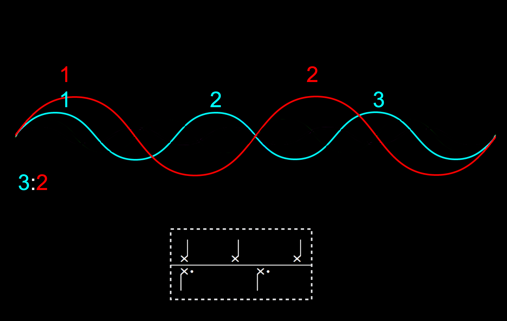
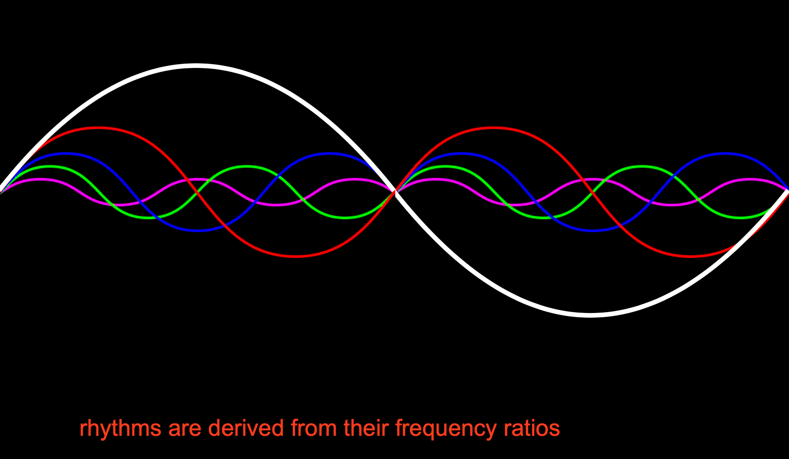

# rhythm/pitch demo

Hear rhythm become pitch before your  ears! :)
To be able to try out this demo:
1. Install SuperCollider from [supercollider.github.io](supercollider.github.io).  
2. Download the [SC_demo_rhythmPitch.scd] (/SC_demo_rhythmPitch.scd) file.
Et voilá!
Now you can speed up the rhythmic patterns by moving the mouse on your screen.

Remember to boot the server (⌘B) first, and then evaluate each line with ⌘⏎.

[source: Hugill, A. (2012). The digital musician. Routledge]
